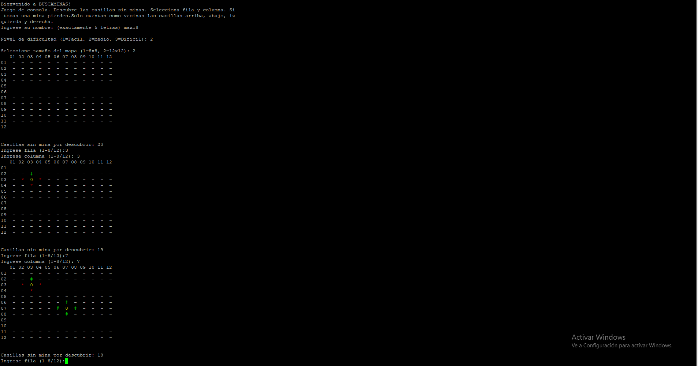

# 🚩 Buscaminas en Assembler (ASM)

### 🚀 Descripción
Un juego de Buscaminas clásico desarrollado íntegramente en lenguaje ensamblador, diseñado para ejecutarse en entornos **Linux** a través de la consola. Este proyecto demuestra habilidades de programación de bajo nivel, gestión de memoria y lógica algorítmica pura.

### 🖥️ Vista del Proyecto

*Interfaz del Buscaminas ejecutándose en consola remota.*

### 🛠️ Stack Tecnológico
* **Lenguaje:** Assembler (ASM).
* **Compilador:** GCC (usando flags para ensamblador).
* **Entorno de Desarrollo:** Servidor Linux remoto accedido mediante **Putty**.
* **Herramientas de Versión:** Git & GitHub.

### 🎮 Características y Funcionalidades
* **Lógica de Bajo Nivel:** Implementación manual de algoritmos para el escaneo de casillas vecinas y conteo de minas.
* **Gestión de Memoria:** Control directo de registros para el manejo del mapa.
* **Mapas Dinámicos:** Selección de tamaño de tablero (8x8 o 12x12).
* **Dificultad Configurable:** Tres niveles de dificultad (Fácil, Medio, Difícil).
* **Validación en Tiempo Real:** Sistema interactivo de ingreso de coordenadas (fila/columna).

### 📂 Compilación y Ejecución
Para compilar y ejecutar este proyecto en un entorno Linux con GCC:

1. **Compilar:**
   ```bash
   gcc -o buscaminas buscaminas.s
2. **Ejecutar:**
   ```bash
   ./buscaminas


Proyecto desarrollado como parte de la formación en la Universidad Nacional de General Sarmiento (UNGS).
